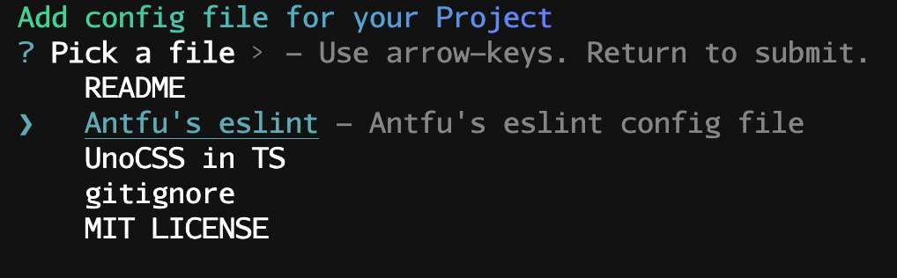

<br>

<p align="center">

</p>

<h1 align="center">CONFIG</h1>

<p align="center">Some configs</p>

## Usage
_I strongly recommend you to use [`download.sh`](download.sh) to download config files cause it will install the packages at the same time._

```shell
$ sh download.sh [config]
```
The slot of [config] is as `Configs` </br>
like `unocss`
```shell
  % Total    % Received % Xferd  Average Speed   Time    Time     Time  Current
                                 Dload  Upload   Total   Spent    Left  Speed
  0     0    0     0    0     0      0      0 --:--:-- --:--:-- --:--:--     0
  100% [==============================] 100% 1.00  kB/s   00:00:00 --:--:-- --:--:--
```

> <p align='center'>Developing: A better ui to add configs</p>
> <br>
> 

## Configs

<details open>
<summary>UnoCss</summary>

🌭 [`unocss`](uno.config.ts) -- **_unocss config file_**
```sh
npm i -D unocss
npm i -D @unocss/preset-icons @iconify-json/carbon
```

</details>

<details open>
<summary>GitIgnore</summary>

🍕 [`gitingore`](.gitignore) -- **_gitignore file_**

- Logs
- dependencies
- Editor directories and files

</details>

<details open>
<summary>MIT LICENSE</summary>

🥞 [`mit`](MITLICENSE) -- **_Mit License_**

- 2022 Year
</details>

<details open>
<summary>READEME</summary>

🥠 [`readme`](READMETemplate.MD) -- **_readme template_**

- Icon slot
- Description slot
- Features slot
- Usage slot
- License slot

</details>

<details open>
<summary>ESLint</summary>

🌮 [`eslint`](./.eslintrc) -- **_eslint config based on AntFu's_**

```sh
npm i -D eslint @antfu/eslint-config
```
- Turned off `arrow-paren`
</details>

## License

[MIT](./LICENSE) License © 2022 [Cheng-DX](https://github.com/Cheng-DX)
